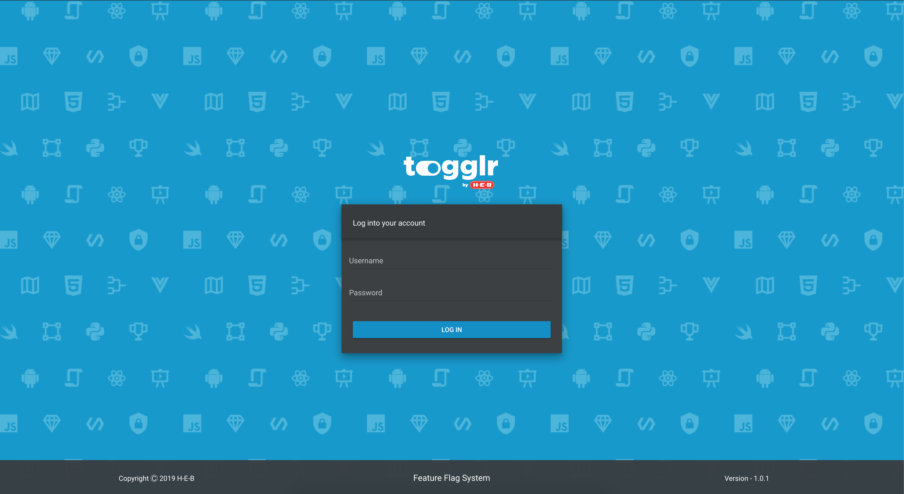
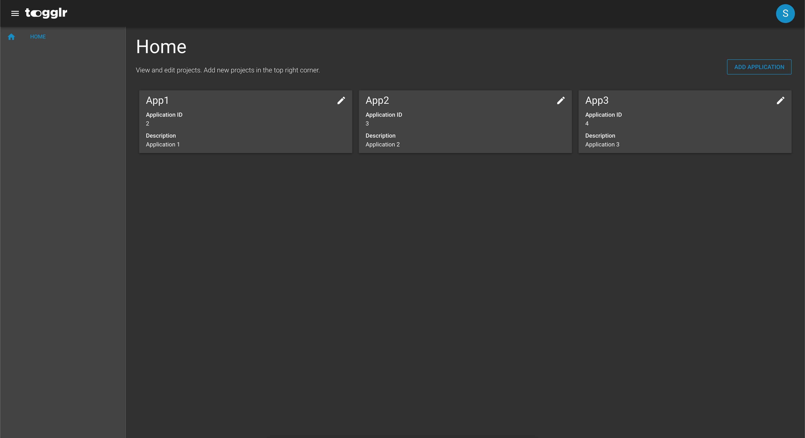
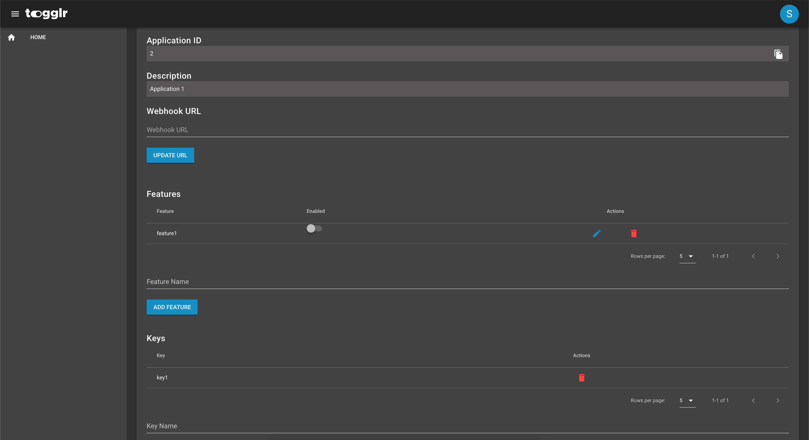
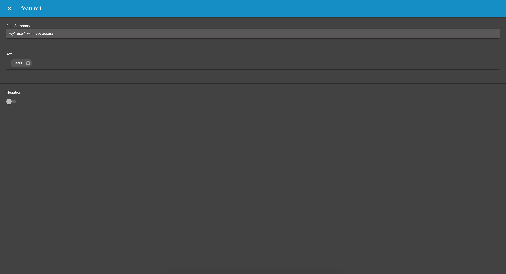

Togglr is an open source, feature flagging application written by H-E-B.  Togglr consists of 5 base components.
- [API](https://github.com/HEB/togglr-api) - Spring Boot application to manage all interactions with Togglr DB and provide base functionality.
- [Client](https://github.com/HEB/togglr-client) - Spring Boot client written to abstract usage of The Togglr API.  Consumed as a JAR.
- [Mysql DB](https://github.com/HEB/togglr-mysql) - Simple docker container with init scripts.  Meant to be replaced with a more permanent solution in production.
- [UI](https://github.com/HEB/togglr-ui) - Nuxt/VueJS application for interacting with API and management of Feature Flags
- Redis - Redis base image pod used for Feature Flag caching.

## Motivation
In order to achieve true CI/CD, feature flags play a major component.  The ability for us to release *production* features on a per push basis enables quick turnaround.  In addition to moving fast, we are able to move safely.  Rather than issuing a full rollback for a feature, a quick toggle off is all that is typically needed.
 
## Screenshots





Include logo/demo screenshot etc.

## Built with
- [Spring Boot](https://spring.io/projects/spring-boot)
- [NUXTJS](https://nuxtjs.org/)
- [Vue.js](https://vuejs.org/)
- [Vuetify](https://vuetifyjs.com/en/)
- [Docker](https://www.docker.com/)
- [Redis](https://redis.io/)
  
## Features
- Dynamic flag rules
- Abstracted client library
- Redis caching
- Webhook updates

## Sample Request

Request to */features/active*

```json
{
  "appId" : 2,
  "configs" : {
    "users" : "user1"
  }
}
```

Response
```json
{
  "availableFeatures": [
    {
      "id": 5,
      "descr": "feature1",
      "appId": 2
    }
  ]
}
```

## Running
In order to run locally, [Docker Compose](https://docs.docker.com/compose/) is required. In the base git repo run `docker-compose up --build`

For production we recommend running in a Kubernetes environment.  Docker images will need to be built for UI and API.  Client will be consumed as a JAR in your API if used.  Mysql DB should be moved to a managed DB but a Mysql pod can be used with risk.  Redis can be consumed as a pod instance.

## License
[Apache-2.0](https://www.apache.org/licenses/LICENSE-2.0)